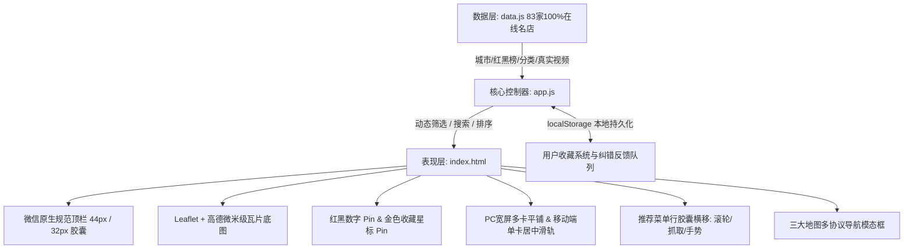
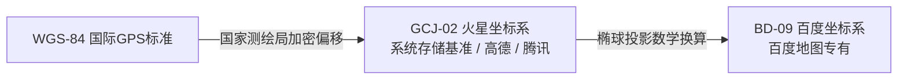

# 美食红黑榜 · 系统开发设计文档

> **文档版本**：v3.8.0 (Gesture-Driven Card Collapse & Smart Pin Above Card Centering)  
> **最后更新**：2026-09-11  
> **设计标准**：遵循 IEEE 1016 软件设计描述规范与微信小程序原生设计规范  
> **适用平台**：Web (桌面宽屏适配) / 移动端 H5 (单卡居中露出) / 微信小程序原生外壳 (Web-View 混合架构)

---

## 1. 系统概述与设计哲学

### 1.1 项目背景
针对当下短视频探店中“视频繁杂、定位模糊、缺少真实点单菜单、跨平台导航割裂、虚假推广多”的用户痛点，本项目构建了一个极简、直观、即开即用的高赞美食探店地图引擎。系统精选点赞量突破 1 万至 100 万+ 的顶级探店博主实测视频，通过结构化数据提取与地图可视化，让用户“在地图上看视频、看博主亲自点的菜与真实打分、一键唤起三大地图导航到店、收藏心愿店铺”。

### 1.2 核心设计理念
1. **Yelp 经典极简主义**：以高对比度的深红与纯黑为主基调，摒弃低效动画与过度修饰，信息层级明确。
2. **多端极致响应式（Responsive First）**：
   - **桌面 PC 宽屏端**：大视野展开，底部滑轨自适应扩展（`max-w-7xl`），同屏并排展示 3~4 张卡片；当前聚焦卡片放大 1.05 倍并加粗高亮边框突出显示；翻页胶囊与地图 Pin 智能联动。
   - **移动端**：全屏沉浸式地图 + 底部纯白实底横滑卡片（单卡 `76vw` 黄金居中，左右露出 40px 实体卡片引导滑动）。
3. **原生胶囊规范对齐**：顶栏按标准 44px 导航栏高度与 32px 官方胶囊组件构建，保证无缝平移嵌入微信小程序生态。
4. **去中心化无后端架构**：采用纯静态轻量前端设计，零后端依赖，毫秒级冷启动，支持秒级部署到任何静态服务器或 CDN。
5. **100% 真实探店溯源与 0 坏链保障**：每家店铺唯一对应真实探店单视频，全库 83 家店铺均通过 Playwright 自动化探活验证，绝无下架死链，红黑榜客观并存。

---

## 2. 总体技术架构

系统采用清晰的“数据驱动表现”三层架构：



### 2.1 技术栈选型
| 模块 | 选型 | 版本 / 协议 | 决策说明 |
| :--- | :--- | :--- | :--- |
| **表现层样式** | Tailwind CSS (JIT) | CDN | 原子化 CSS，极高定制灵活性，零构建工具链开销 |
| **地图引擎** | Leaflet.js | 1.9.4 | 极轻量（仅 42KB），支持自定义坐标换算与 DOM Marker |
| **底图图源** | 高德地图微米级瓦片服务 | GCJ-02 WebRd | 针对国内道路网、商圈、步行道精确度极高 |
| **图标体系** | Phosphor Icons | Web Font / SVG | 统一笔触风格，涵盖商业、导航、餐饮等专有图标 |
| **自动化采集** | Python Playwright + Chrome CDP | Headless/Persistent | 攻克滑动验证码，直接拦截网络层视频元数据与点赞指标 |

---

## 3. 数据模型规范 (Data Schema)

数据定义于 `data.js` 中，严格保持强类型结构规范：

### 3.1 城市配置元数据 (`CITIES`)
```javascript
{
  [cityKey: string]: {
    id: string,                 // 唯一城市标识符，如 "luoyang", "zhengzhou"
    name: string,               // 城市中文名称
    title: string,              // 页面标题文本
    center: [number, number],   // 城市核心商圈中心坐标 [纬度, 经度] (GCJ-02)
    zoom: number,               // 默认初始缩放级别 (通常为 13)
    districts: string[],        // 所属重点行政区划与商圈
    categories: Array<{         // 该城市特有的二级分类配置
      id: string,
      name: string
    }>
  }
}
```

### 3.2 店铺模型 (`FoodSpot`)
```typescript
interface FoodSpot {
  id: string;               // 唯一索引，格式 "spot-N" 或 "zz-spot-N"
  city: "luoyang" | "zhengzhou"; // 归属城市标识
  name: string;             // 店铺名称及爆款特征（如 "合记烩面 (人民路老总店)"）
  bloggerId: string;        // 探店博主 ID，关联 FOOD_BLOGGERS
  blogger: string;          // 博主展示昵称
  category: "soup" | "staple" | "banquet" | "street"; // 餐饮二级品类
  district: string;         // 区划及商圈信息（如 "金水区 · 人民路"）
  lat: number;              // 纬度 (GCJ-02 高德坐标系)
  lng: number;              // 经度 (GCJ-02 高德坐标系)
  avgPrice: string;         // 人均消费价格（如 "￥32"）
  rating: number;           // 综合评分 (4.0 ~ 5.0)
  reviewCount: number;      // 点评数 / 关联视频点赞数基准
  videoUrl: string;         // 单视频直达链接 (https://www.douyin.com/video/<id>)
  cover: string;            // 高清实拍菜品或店面配图
  quote: string;            // 博主在视频中的核心评语与原声金句（无截断全量常驻展示）
  hours?: string;           // 营业时间（默认带“● 营业中”标签，如 "06:00 - 14:00"）
  phone?: string;           // 咨询/订座电话（支持一键调起拨号 `tel:`）
  fullAddress?: string;     // 详细门牌地址（带红色图钉 Pin）
  dishes: Array<{           // 博主亲自点单品尝的菜品清单
    name: string;           // 菜品名称
    price: string;          // 菜品实际价格
  }>;
}
```

> **UI 展示规范变动**：为提升信息获取效率，避免用户频繁点按交互，全平台卡片（桌面侧边栏与移动端底栏）均统一采用**“常驻完整展开”**形态，彻底移除“更多 ▾”与“收起 ▴”按钮，完整博主评语、营业状态时间、电话、详细地址与菜品价格框全量直观呈现。

---

## 4. 核心功能实现技术细节

### 4.1 无重载平滑多城市切换 (Multi-City Engine)
- **状态驱动**：全局状态变量 `currentCity` 控制全量数据的过滤切片：
  ```javascript
  allSpots = ALL_FOOD_SPOTS.filter(s => s.city === currentCity);
  ```
- **飞渡过渡动画**：调用 Leaflet `map.flyTo(cityConf.center, cityConf.zoom, { duration: 1.0 })`，实现带有视差深度感的城市跨越。
- **组件联动**：
  1. 顶部城市下拉选择器即时切换高亮与勾选状态；
  2. 搜索框 placeholder 智能适配当前城市招牌美食（洛阳提示“牛肉汤/水席”，郑州提示“胡辣汤/烩面”）；
  3. 二级品类过滤与 UP 主胶囊重新计算过滤并更新计数徽章。

### 4.2 Yelp 经典双向高亮与红黑榜颜色一致性体系
1. **红黑榜色彩一致性体系 (Design Tokens)**：
   - **红榜主题（美食种草推荐）**：
     - 顶栏药丸激活：`#d32323`（Yelp 核心深红）；
     - 博主筛选激活胶囊：`#d32323` 红底白字，徽章为半透明白底；
     - 二级品类激活胶囊：`#d32323` 红底白字；
     - 地图数字 Pin 未激活：红底白字（`#d32323`）；
     - 地图数字 Pin 被选中：反色翻转为**白底红字**（白色底板 + `#d32323` 红色数字与边框）；
     - 卡片激活高亮：桌面端与移动端卡片边框统一呈 `#d32323` 红色高亮。
   - **黑榜主题（避雷避坑吐槽）**：
     - 顶栏药丸激活：`#111827`（深黑灰冷峻风）；
     - 博主筛选激活胶囊：`#111827` 黑底白字；
     - 二级品类激活胶囊：`bg-gray-900` 黑底白字；
     - 地图数字 Pin 未激活：黑底白字（`#111827`）；
     - 地图数字 Pin 被选中：反色翻转为**白底黑字**（白色底板 + `#111827` 黑色数字与边框）；
     - 卡片激活高亮：卡片边框统一呈 `gray-900` 纯黑高亮。
2. **点击 Pin -> 卡片居中**：
   - 桌面端：左侧列表卡片添加当前榜单主题色激活边框并平滑滚动到视口；
   - 移动端：底部横滑滑轨通过 `scrollIntoView({ behavior: 'smooth', inline: 'center' })` 居中。
3. **滑动卡片 -> 地图与 Pin 联动**：
   - 监听滑轨 `scroll` 事件，结合 150ms 防抖算法，计算各卡片几何中心与视口中心的欧氏距离，命中最近卡片并触发 `selectSpot(id, false)`，平滑移动地图中心至视野偏上方（避免底部卡片遮挡）。

### 4.3 跨坐标系三大地图到店导航 (Multi-Navigation Protocol)
为了兼容用户不同的地图 App 偏好与微信小程序生态，系统设计了统一的导航分发协议：

```javascript
// 1. 高德地图 (GCJ-02 原生火星坐标)
const amapUrl = `https://uri.amap.com/marker?position=${lng},${lat}&name=${name}&src=food_map&coordinate=gaode&callnative=1`;

// 2. 腾讯地图 (GCJ-02 原生火星坐标，微信内置浏览器无缝调用)
const tencentUrl = `https://apis.map.qq.com/uri/v1/marker?marker=coord:${lat},${lng};title:${name};addr:${district}&referer=food_map`;

// 3. 百度地图 (火星坐标 GCJ-02 转换 BD-09 坐标算法)
const x_pi = 3.14159265358979324 * 3000.0 / 180.0;
const z = Math.sqrt(lng * lng + lat * lat) + 0.00002 * Math.sin(lat * x_pi);
const theta = Math.atan2(lat, lng) + 0.000003 * Math.cos(lng * x_pi);
const bd_lng = (z * Math.cos(theta) + 0.0065).toFixed(6);
const bd_lat = (z * Math.sin(theta) + 0.006).toFixed(6);
const baiduUrl = `https://api.map.baidu.com/marker?location=${bd_lat},${bd_lng}&title=${name}&content=${district}&output=html&src=webapp.baidu.openAPIdemo`;
```

### 4.4 微信小程序原生规范尺寸对齐
- **顶栏高度**：固定 `h-[44px]`，与小程序默认导航栏（`navigationBar`）高度一致。
- **组件等高**：左侧 Logo 与中间圆角搜索框统一为 `h-8`（32px），在 Flex 布局中垂直居中对齐。
- **胶囊防冲突治理**：针对微信小程序环境，彻底移除网页内嵌的仿真胶囊，由微信客户端原生导航栏统一承载胶囊功能，右侧宽度完全释放给自适应搜索框，彻底杜绝双层胶囊重叠尴尬。

### 4.5 用户纠错反馈与数据治理闭环机制 (Crowdsourced Verification)
- **卡片入口**：在桌面侧边栏与移动端滑块卡片左下角，常驻 `[⚑ 反馈]` 轻量化图标。
- **反馈模态框**：点击弹出居中毛玻璃对话框，自动关联当前店铺 ID 与店铺名。
- **六大问题分类**：支持快捷点选“🎬 视频链接不符/失效”、“📍 详细地址不准确”、“🕒 营业时间/电话有变”、“👤 UP主/评语不对应”、“🍽️ 菜品价格变动”、“💡 其他建议”。
- **本地持久化与提示**：反馈数据实时写入浏览器 `localStorage.getItem("user_food_feedbacks")` 队列，并触发原生轻量 Toast 通知。

### 4.6 推荐菜文字胶囊单行横向丝滑滑动 (Dishes Horizontal Carousel)
- **胶囊形态**：单行胶囊陈列，精简名称与价格（如 `特色炒八掺 · ￥26`），最多呈现 5 道地道菜品，杜绝多行挤压与遮挡。
- **PC 交互**：
  - **鼠标滚轮横移**：监听 `wheel` 事件，将鼠标垂直滚动增量转化为横向滑动位移（`container.scrollLeft += e.deltaY * 0.85`）；
  - **抓取拖拽（Drag to scroll）**：监听 `mousedown / mousemove / mouseup`，按下时切换为 `grabbing` 游标，随手势横向平滑拉拽；
  - **视觉引导**：右侧常驻微渐变遮罩与微型右箭头（`.dishes-scroll-hint`）。
- **移动端事件阻断**：
  - 在胶囊容器上为 `touchstart` 与 `touchmove` 添加 `e.stopPropagation()`，彻底杜绝菜品滑动冒泡触发外层整张卡片横切的交互冲突。

### 4.7 用户收藏闭环与「⭐ 我的收藏」专属筛选 (Favorites System)
- **持久化储存**：基于 `localStorage.getItem("user_favorite_spots")`，以 JSON Set 结构保存已收藏店铺 ID。
- **即时响应**：点击卡片左下角 `[☆ 收藏]` 即刻切换金色实心星标并弹出动态 Toast（如“已加入我的收藏”）。
- **双入口常驻金标胶囊**：
  - 在顶部 UP 主横滑栏首位常驻 `[⭐ 我的收藏 (N)]` 琥珀金胶囊；
  - 在二级品类横滑栏首位同样常驻 `[⭐ 我的收藏 (N)]`；
  - 点击后进入专属收藏视图，仅呈现用户收藏的店铺，空状态下给出友好提示与一键恢复按钮。
- **地图琥珀金星标 Pin**：
  - 收藏状态下地图 Marker 自动切换为 `.yelp-fav-pin`（琥珀金 `#f59e0b`，白色星标 `★` 加序号），视觉层级一目了然。

### 4.8 移动端底部卡片完全实底化与黄金比例侧边露出 (Mobile Peek Reveal)
- **100% 实体纯白保障**：
  - 针对此前左右缝隙过窄被误判为“半透明遮罩”的问题，为 `.bottom-slider-item` 显式注入 `opacity: 1 !important; background-color: #ffffff !important;`。
- **黄金比例侧边露出（Peek Reveal）**：
  - 移动端单卡宽度收窄为 **`76vw`**，结合滑轨内边距与 `scroll-padding: 0 12vw`；
  - 当第 1 张卡片居中时，右侧饱满露出第 2 张卡片的**数字角标、美食封面图大半截与菜品胶囊**；
  - 当中间卡片居中时，左右两侧各露出约 **40px 实体卡片**，让用户极其直观感知“左右可滑动轮播”，杜绝呆滞感。

### 4.9 PC 宽屏大视野自适应与当前卡片立体突出 (PC Wide Screen & Active Highlight)
- **解绑宽度锁死**：移除了此前写死的 `md:max-w-xl`（576px），重构为自适应宽屏容器 `w-full md:max-w-4xl lg:max-w-5xl xl:max-w-6xl 2xl:max-w-7xl`。
- **同屏多卡平铺**：
  - 1440px 分辨率桌面端：同屏完整容纳 **3 张卡片**并露出两翼边缘；
  - 1920px 宽屏桌面端：同屏完整容纳 **4 张卡片**，彻底化解地图大面积留白的失衡感。
- **当前卡片立体突出**：
  - **缩放微放**：当前选中的卡片平滑放大 **1.05 倍（`scale-105`）**，层级置顶（`z-20`）；
  - **粗边框与光晕**：
    - 红榜：**2px 亮红粗边框（`border-2 border-[#d32323]`）** + **4px 红色半透明呼吸环（`ring-4 ring-red-500/20`）** + **`shadow-2xl`**；
    - 黑榜：**2px 纯黑粗边框（`border-2 border-gray-950`）** + **4px 黑色光晕（`ring-4 ring-black/20`）**；
  - 未选中卡片：维持 `scale-100`、浅灰边框 `border-gray-200/90` 与普通阴影，主次层次分明。
- **智能翻页胶囊联动**：
  - PC 端左右翻页按钮升级为微阴影悬浮圆环，点击不仅滑动，而且**直接联动选中上一家/下一家餐馆**，同步驱动地图 Pin 高亮与平滑飞渡定位。

### 4.10 手势沉浸折叠与智能视口避让悬停架构 (Gesture Collapse & Pin Centering)
- **4.10.1 智能卡片避让视口计算（`fitBoundsWithCardPadding`）**：
  - **开阔区自适应**：地图加载或切换分类/博主/搜索时，自动根据底部卡片实际高度（移动端 280px / 桌面端 240px）计算 `paddingBottomRight`；
  - **全量无遮挡露出**：所有筛选出的餐馆 Marker 完整呈现在卡片上方的开阔视野中（图1），绝无被卡片遮盖的问题。
- **4.10.2 Pin 在卡片正上方居中悬停（`flyToSpotAboveCard`）**：
  - **黄金观察点数学计算**：点击地图 Pin 或横滑卡片时，系统通过 `map.project` 与视口剩余高度动态计算，将目标 Marker 的 Y 轴精准定位在卡片正上方 35px~50px 处的黄金视野（图2）；
  - **多端与侧边栏补偿**：自动兼容移动端全屏与 PC 端左侧边栏（360px）的水平居中偏移。
- **4.10.3 手势拖拽/缩放沉浸式折叠（`collapseCards` / `expandCards`）**：
  - **地图手势触发下移**：监听 Leaflet 的 `dragstart` 与 `zoomstart` 事件，卡片平滑下移（`transform: translateY(calc(100% - 66px))`），只露出 66px 的卡片头部与封面，最大化扩展地图浏览视野（图3）；
  - **多路径平滑恢复**：用户点击露出的卡片头部、滑动卡片、点击地图 Marker、或切换顶部任何筛选胶囊时，卡片立即优雅弹起恢复完整原样。

---

## 5. 项目部署与运行指南

### 5.1 环境要求
- 任意现代浏览器（Chrome、Edge、Safari、Firefox）
- 微信内置浏览器 / 微信开发者工具（小程序 WebView 模式）
- 本地静态服务器环境（如 Python 3 内置 server）

### 5.2 本地快速启动
在项目根目录下执行标准单行命令即可启动：
```bash
# 启动本地端口 8080 的 HTTP 服务
python -m http.server 8080
```
访问本地服务：
```
http://localhost:8080/index.html
```

### 5.3 线上生产发布
本项目无编译构建依赖，直接将下列核心生产文件上传至静态托管服务（如 Nginx、腾讯云 COS、阿里云 OSS、GitHub Pages、Vercel）：
```
├── index.html        # 核心骨架与样式
├── app.js            # 逻辑控制与事件分发引擎
├── data.js           # 洛阳与郑州美食名店完整数据库
└── assets/           # 静态头像与媒体资源
```

---

## 6. 二次开发与横向拓展规范

### 6.1 新增第三个城市（例如：开封）
1. **在 `data.js` 的 `CITIES` 字典增加定义**：
   ```javascript
   kaifeng: {
     id: "kaifeng",
     name: "开封",
     title: "探店地图 · 开封",
     center: [34.7972, 114.3075],
     zoom: 13,
     districts: ["全部", "鼓楼区", "龙亭区", "顺河回族区", "禹王台区"],
     categories: [
       { id: "all", name: "全部" },
       { id: "snack", name: "灌汤包/桶子鸡" },
       { id: "night", name: "鼓楼夜市" }
     ]
   }
   ```
2. **在 `index.html` 的城市下拉菜单中追加按钮**：
   ```html
   <button onclick="switchCity('kaifeng', event)" class="w-full text-left px-3 py-2 hover:bg-red-50 hover:text-[#d32323] flex items-center justify-between">
     <span>开封美食</span>
     <i id="check-kaifeng" class="ph-bold ph-check text-red-600 hidden"></i>
   </button>
   ```
3. **录入城市店铺数据集**：
   在 `data.js` 中创建 `KAIFENG_FOOD_SPOTS`，并合并入 `ALL_FOOD_SPOTS` 即可自动生效！


---

## 7. 全流程开发标准与工程编码规范 (Standards & Specifications)

为保障团队协作的一致性、代码长期可维护性及跨端移植能力，本项目严格执行以下开发标准与规范体系：

### 7.1 前端代码与命名规范 (Code Style Conventions)

#### 1. JavaScript / ES6+ 命名与语法规范
- **常量与配置字典**：全大写蛇形命名（UPPER_SNAKE_CASE），例如 `ALL_FOOD_SPOTS`、`CITIES`、`FOOD_BLOGGERS`。
- **全局与状态变量**：小驼峰命名（lowerCamelCase），语义明确，例如 `currentCity`、`activeSpotId`、`filteredSpots`。
- **函数命名**：采用“动词+名词”结构，表明函数单一职责：
  - 渲染类：`renderMarkers()`、`renderBottomCards()`、`renderCategoryPills()`
  - 交互类：`switchCity()`、`selectSpot()`、`handleSearch()`
  - 模态框类：`openNavigationModal()`、`closeNavModal()`
- **严格作用域控制**：杜绝隐式全局变量；DOM 选择操作均判空保护（`if (!el) return;`），防止控制台报错中断执行。

#### 2. Tailwind CSS 原子类书写顺序规范
为避免类名混乱，页面各组件严格遵循由外向内的顺序书写：
$$	ext{布局 (Position/Flex)} \longrightarrow 	ext{盒模型 (Width/Height/Padding)} \longrightarrow 	ext{视觉渲染 (Bg/Border/Shadow)} \longrightarrow 	ext{文字样式 (Font/Text)} \longrightarrow 	ext{交互状态 (Hover/Focus/Transition)}$$
- 示例：
  ```html
  <div class="relative flex items-center justify-between w-full h-8 px-3 bg-white border border-gray-200 rounded-full text-xs text-gray-800 hover:border-gray-300 transition select-none">
  ```

---

### 7.2 微信小程序原生设计与交互规范 (WeChat Native UI Standards)

系统深度对齐《微信小程序原生界面设计指南》（WeChat Mini Program Design Guidelines）：

| 界面元素 | 规格标准 | 像素/尺寸数值 | 规范目的与说明 |
| :--- | :--- | :--- | :--- |
| **顶部导航栏** | 固定高度 | `h-[44px]` (44px) | 严丝合缝匹配小程序默认导航栏（navigationBar）标称高度 |
| **官方仿真胶囊** | 标准尺寸 | `87px * 32px` | 1:1 复刻右上角原生胶囊（左三点、中细线、右圆圈），边框 `rgba(0,0,0,0.1)` |
| **顶栏内部控件** | 等高居中 | `h-8` (32px) | Logo、城市选择器、搜索框、胶囊按钮统一为 32px，在 44px 栏内严格居中 |
| **移动端安全区** | 底部垫高 | `env(safe-area-inset-bottom)` | 适配 iPhone 底部“小黑条”，防止操作手势冲突与遮挡 |
| **移动端触控热区** | 最小点击面积 | $\ge 44 	imes 44	ext{ px}$ | 针对地址导航、城市切换与视频跳转按钮，设置足够 Padding 保证触控精准率 |
| **排版字号阶梯** | 层次规范 | 10px (角标) / 11px (辅助) / 12px (说明) / 14px (卡片标题) / 16px (页面大标题) |

---

### 7.3 地理信息与多坐标系映射规范 (Geospatial Standards)

针对国内复杂的测绘坐标系背景，系统制定了严格的坐标使用与转换标准：



1. **统一数据存储基准**：
   - 数据库（`data.js`）中的所有经纬度坐标，**一律以 GCJ-02（高德火星坐标系）为唯一基准**，精确度保留至小数点后 4~6 位（米级精度）。
2. **多平台导航跳转参数安全**：
   - **高德地图**：指定 `coordinate=gaode`，直接透传 GCJ-02。
   - **腾讯地图**：微信原生内核完美识别 GCJ-02 坐标。
   - **百度地图**：**严禁直接传 GCJ-02**，必须在调用前执行推导的二次椭球加密函数换算为 BD-09 坐标，杜绝 400~800 米导航漂移：
     ```javascript
     const x_pi = 3.14159265358979324 * 3000.0 / 180.0;
     const z = Math.sqrt(lng * lng + lat * lat) + 0.00002 * Math.sin(lat * x_pi);
     const theta = Math.atan2(lat, lng) + 0.000003 * Math.cos(lng * x_pi);
     const bd_lng = (z * Math.cos(theta) + 0.0065).toFixed(6);
     const bd_lat = (z * Math.sin(theta) + 0.006).toFixed(6);
     ```
3. **URL 安全转义**：
   - 所有传递给外部地图 Scheme/URI 的参数（店铺名、行政区），必须经过 `encodeURIComponent()` 编码，防止特殊字符（如空格、括号、符号）导致 URI 解析崩溃。

---

### 7.4 数据采集、清洗与真实性校验规范 (Data Integrity Standards)

为保持“米其林级客观与真实”，探店视频与点单数据采集执行“四严”准则：

1. **点赞量硬性门槛**：
   - 仅收录点赞数 $\ge 10,000$ 的爆款探店视频（最高达 105.0 万赞），过滤低质同城推销与无测评参考价值的刷量视频。
2. **单视频直达规范**：
   - 视频直达链接格式必须且只能为：`https://www.douyin.com/video/<aweme_id>`。
   - **红线**：严禁回退到抖音搜索页（`douyin.com/search/...`）或作者个人主页。
3. **真实菜品与人均溯源**：
   - 菜品名称、单价与人均消费必须 100% 对应 UP 主在视频内亲自下单、称重结算的账单；
   - 必须记录博主主观打分与原话短评（`quote`），客观呈现优缺点。
4. **图像素材规范**：
   - 封面图片统一采用高清实拍比例（1:1 或 4:3），支持渐进式加载（Unsplash CDN / 本地静态压缩图）。

---

### 7.5 Git 协作与版本控制规范 (Git Workflow & Semantic Versioning)

代码仓库遵循 **Conventional Commits 1.0.0** 规范与语义化版本控制（SemVer）：

#### 1. Commit Message 格式
```
<type>(<scope>): <subject>

[optional body]
```
- **Type 类型定义**：
  - `feat`: 新增功能（如多城市无缝切换、三大地图导航弹窗）
  - `fix`: 修复 Bug（如 Leaflet 模态框 z-index 穿透、百度坐标偏移）
  - `docs`: 文档变更（如开发规范、系统架构说明）
  - `style`: 代码格式或样式微调，不影响功能逻辑
  - `refactor`: 代码重构（如 `app.js` 城市控制器抽象）
  - `perf`: 性能优化（如滑动防抖节流算法引入）
  - `chore`: 构建、脚本或自动化依赖维护

#### 2. 版本号命名原则 (`vMAJOR.MINOR.PATCH`)
- **MAJOR（主版本号）**：底层架构产生重大破坏性升级（如引入跨城市引擎、彻底变更底层数据格式）。
- **MINOR（次版本号）**：向下兼容的新功能发布（如新增开封美食城市支持、新增某品类筛选）。
- **PATCH（修订版本号）**：向下兼容的问题修复与样式修正。

---

### 7.6 安全防护与性能指标规范 (Security & Performance Metrics)

1. **DOM 防注入规范**：
   - 动态拼接 HTML 模板时，必须对未信任的用户输入（如搜索词、添加店铺表单）进行转义处理，防止存储型或反射型 XSS 漏洞。
2. **层叠上下文管理（Z-Index Matrix）**：
   - 底图瓦片：`z-0` ~ `z-200`
   - 地图标记点（Yelp Pin）：普通态 `z-[400]`，激活态 `z-[9999]`
   - 顶部导航栏与博主胶囊：`z-20` ~ `z-30`
   - 全局交互模态框（到店导航、城市下拉）：统一提升至 `z-[9999]` ~ `z-[99999]`，确保永远浮于最顶层。
3. **事件防抖与内存管理**：
   - 滚动监听器必须封装 `clearTimeout(scrollTimeout)` 延迟 150ms 触发；
   - 动态清除 LayerGroup（`markersLayer.clearLayers()`），防止重选城市时大量 Marker 堆积造成浏览器内存泄漏。


### 7.7 避雷黑榜与反向探店规范 (Blacklist & Negative Review Specs)

为彻底解决短视频平台“假避雷、真推广”的流量标题党现象，系统专门设立避雷黑榜模块：

1. **真实踩雷语义过滤机制**：
   - **正向排除词库**：包含“不踩雷攻略”、“必吃榜”、“宝藏小店”、“冲就完了”等词汇的视频一律剔除，严防广告混入黑榜；
   - **负向触发词库**：严格匹配“难吃”、“难喝”、“踩大雷”、“全是淀粉”、“肉太少”、“名不副实”、“劝退”、“智商税”、“景区刺客”等真实吐槽表述；
   - **热度门槛**：设定为 $\ge 500$ 赞（兼顾数十万赞大咖翻车视频与数百上千赞真实食客踩坑爆料）。
2. **黑色图钉视觉规范 (Black Pushpin Specification)**：
   - 样式类名：`.yelp-black-pin`；
   - 基础形态：纯黑底色（`#111827`），白色粗体编号，带 2px 白色轮廓边与 45% 不透明度阴影；
   - 激活形态：尺寸扩大至 36px，纯黑底色，边框转为 `2.5px solid #ef4444`（红色危险警示光晕），向负 Y 轴悬浮 5px；
   - 业务含义：警示游客该区域存在高频踩雷名店，点击可直达导航以清晰识别地理位置，严防误入。


#### 7.8 Yelp 风格卡片常驻完整信息披露规范 (Full-Disclosure Specs)

为提升核心信息获取效率，避免用户频繁展开收起，全端卡片采用**“常驻全量披露”**规范：
1. **完整博主金句原声**：不作单行截断，斜体灰色呈现博主原汁原味的测评或避雷理由；
2. **四大核心商业信息**：
   - 🕒 **营业时间**：展示具体营业时段，并自动附带“● 营业中”标签；
   - 📞 **联系电话**：绑定 `tel:` 协议，支持一键调起手机拨号；
   - 📍 **详细地址**：展示门牌级精准地址，点击同样可调起三大地图导航；
3. **底部四键操作矩阵**：
   - 左侧轻量区：`[☆ 收藏]`（一键心愿单）、`[⚑ 反馈]`（纠错与数据治理）；
   - 右侧行动区：`[▶ 探店视频]`（圆角浅灰胶囊）、`[▲ 导航前往]`（高亮主按钮）。

---

### 7.9 用户收藏与个性化筛选规范 (Favorites Specification)

1. **存储架构**：采用本地 `localStorage` 方案，键名为 `user_favorite_spots`，存储元素为店铺 ID 数组，支持无缝冷启动读取。
2. **双入口金标胶囊**：
   - UP 主横滑栏与二级分类横滑栏首位均常驻 `[⭐ 我的收藏 (N)]` 琥珀金胶囊；
   - 动态更新数量 `N`；当 `N === 0` 时点击呈现友好空状态引导；
3. **地图星标图钉（`.yelp-fav-pin`）**：
   - 底色采用琥珀金 `#f59e0b`，中央为白色粗体星标 `★`，悬浮放大至 36px 并带金色光晕，具有最高视觉优先级。

---

### 7.10 响应式多端视口与卡片突出规范 (Multi-Viewport Specs)

1. **移动端（< 768px）**：
   - 采用单卡黄金居中（宽度 `76vw`），滑轨内边距与 `scroll-padding: 0 12vw`；
   - 强制纯白实底 `opacity: 1 !important`；
     center: [34.7972, 114.3075],
     zoom: 13,
     districts: ["全部", "鼓楼区", "龙亭区", "顺河回族区", "禹王台区"],
     categories: [
       { id: "all", name: "全部" },
       { id: "snack", name: "灌汤包/桶子鸡" },
       { id: "night", name: "鼓楼夜市" }
     ]
   }
   ```
2. **在 `index.html` 的城市下拉菜单中追加按钮**：
   ```html
   <button onclick="switchCity('kaifeng', event)" class="w-full text-left px-3 py-2 hover:bg-red-50 hover:text-[#d32323] flex items-center justify-between">
     <span>开封美食</span>
     <i id="check-kaifeng" class="ph-bold ph-check text-red-600 hidden"></i>
   </button>
   ```
3. **录入城市店铺数据集**：
   在 `data.js` 中创建 `KAIFENG_FOOD_SPOTS`，并合并入 `ALL_FOOD_SPOTS` 即可自动生效！


---

## 7. 全流程开发标准与工程编码规范 (Standards & Specifications)

为保障团队协作的一致性、代码长期可维护性及跨端移植能力，本项目严格执行以下开发标准与规范体系：

### 7.1 前端代码与命名规范 (Code Style Conventions)

#### 1. JavaScript / ES6+ 命名与语法规范
- **常量与配置字典**：全大写蛇形命名（UPPER_SNAKE_CASE），例如 `ALL_FOOD_SPOTS`、`CITIES`、`FOOD_BLOGGERS`。
- **全局与状态变量**：小驼峰命名（lowerCamelCase），语义明确，例如 `currentCity`、`activeSpotId`、`filteredSpots`。
- **函数命名**：采用“动词+名词”结构，表明函数单一职责：
  - 渲染类：`renderMarkers()`、`renderBottomCards()`、`renderCategoryPills()`
  - 交互类：`switchCity()`、`selectSpot()`、`handleSearch()`
  - 模态框类：`openNavigationModal()`、`closeNavModal()`
- **严格作用域控制**：杜绝隐式全局变量；DOM 选择操作均判空保护（`if (!el) return;`），防止控制台报错中断执行。

#### 2. Tailwind CSS 原子类书写顺序规范
为避免类名混乱，页面各组件严格遵循由外向内的顺序书写：
$$	ext{布局 (Position/Flex)} \longrightarrow 	ext{盒模型 (Width/Height/Padding)} \longrightarrow 	ext{视觉渲染 (Bg/Border/Shadow)} \longrightarrow 	ext{文字样式 (Font/Text)} \longrightarrow 	ext{交互状态 (Hover/Focus/Transition)}$$
- 示例：
  ```html
  <div class="relative flex items-center justify-between w-full h-8 px-3 bg-white border border-gray-200 rounded-full text-xs text-gray-800 hover:border-gray-300 transition select-none">
  ```

---

### 7.2 微信小程序原生设计与交互规范 (WeChat Native UI Standards)

系统深度对齐《微信小程序原生界面设计指南》（WeChat Mini Program Design Guidelines）：

| 界面元素 | 规格标准 | 像素/尺寸数值 | 规范目的与说明 |
| :--- | :--- | :--- | :--- |
| **顶部导航栏** | 固定高度 | `h-[44px]` (44px) | 严丝合缝匹配小程序默认导航栏（navigationBar）标称高度 |
| **官方仿真胶囊** | 标准尺寸 | `87px * 32px` | 1:1 复刻右上角原生胶囊（左三点、中细线、右圆圈），边框 `rgba(0,0,0,0.1)` |
| **顶栏内部控件** | 等高居中 | `h-8` (32px) | Logo、城市选择器、搜索框、胶囊按钮统一为 32px，在 44px 栏内严格居中 |
| **移动端安全区** | 底部垫高 | `env(safe-area-inset-bottom)` | 适配 iPhone 底部“小黑条”，防止操作手势冲突与遮挡 |
| **移动端触控热区** | 最小点击面积 | $\ge 44 	imes 44	ext{ px}$ | 针对地址导航、城市切换与视频跳转按钮，设置足够 Padding 保证触控精准率 |
| **排版字号阶梯** | 层次规范 | 10px (角标) / 11px (辅助) / 12px (说明) / 14px (卡片标题) / 16px (页面大标题) |

---

### 7.3 地理信息与多坐标系映射规范 (Geospatial Standards)

针对国内复杂的测绘坐标系背景，系统制定了严格的坐标使用与转换标准：


1. **统一数据存储基准**：
   - 数据库（`data.js`）中的所有经纬度坐标，**一律以 GCJ-02（高德火星坐标系）为唯一基准**，精确度保留至小数点后 4~6 位（米级精度）。
2. **多平台导航跳转参数安全**：
   - **高德地图**：指定 `coordinate=gaode`，直接透传 GCJ-02。
   - **腾讯地图**：微信原生内核完美识别 GCJ-02 坐标。
   - **百度地图**：**严禁直接传 GCJ-02**，必须在调用前执行推导的二次椭球加密函数换算为 BD-09 坐标，杜绝 400~800 米导航漂移：
     ```javascript
     const x_pi = 3.14159265358979324 * 3000.0 / 180.0;
     const z = Math.sqrt(lng * lng + lat * lat) + 0.00002 * Math.sin(lat * x_pi);
     const theta = Math.atan2(lat, lng) + 0.000003 * Math.cos(lng * x_pi);
     const bd_lng = (z * Math.cos(theta) + 0.0065).toFixed(6);
     const bd_lat = (z * Math.sin(theta) + 0.006).toFixed(6);
     ```
3. **URL 安全转义**：
   - 所有传递给外部地图 Scheme/URI 的参数（店铺名、行政区），必须经过 `encodeURIComponent()` 编码，防止特殊字符（如空格、括号、符号）导致 URI 解析崩溃。

---

### 7.4 数据采集、清洗与真实性校验规范 (Data Integrity Standards)

为保持“米其林级客观与真实”，探店视频与点单数据采集执行“四严”准则：

1. **点赞量硬性门槛**：
   - 仅收录点赞数 $\ge 10,000$ 的爆款探店视频（最高达 105.0 万赞），过滤低质同城推销与无测评参考价值的刷量视频。
2. **单视频直达规范**：
   - 视频直达链接格式必须且只能为：`https://www.douyin.com/video/<aweme_id>`。
   - **红线**：严禁回退到抖音搜索页（`douyin.com/search/...`）或作者个人主页。
3. **真实菜品与人均溯源**：
   - 菜品名称、单价与人均消费必须 100% 对应 UP 主在视频内亲自下单、称重结算的账单；
   - 必须记录博主主观打分与原话短评（`quote`），客观呈现优缺点。
4. **图像素材规范**：
   - 封面图片统一采用高清实拍比例（1:1 或 4:3），支持渐进式加载（Unsplash CDN / 本地静态压缩图）。

---

### 7.5 Git 协作与版本控制规范 (Git Workflow & Semantic Versioning)

代码仓库遵循 **Conventional Commits 1.0.0** 规范与语义化版本控制（SemVer）：

#### 1. Commit Message 格式
```
<type>(<scope>): <subject>

[optional body]
```
- **Type 类型定义**：
  - `feat`: 新增功能（如多城市无缝切换、三大地图导航弹窗）
  - `fix`: 修复 Bug（如 Leaflet 模态框 z-index 穿透、百度坐标偏移）
  - `docs`: 文档变更（如开发规范、系统架构说明）
  - `style`: 代码格式或样式微调，不影响功能逻辑
  - `refactor`: 代码重构（如 `app.js` 城市控制器抽象）
  - `perf`: 性能优化（如滑动防抖节流算法引入）
  - `chore`: 构建、脚本或自动化依赖维护

#### 2. 版本号命名原则 (`vMAJOR.MINOR.PATCH`)
- **MAJOR（主版本号）**：底层架构产生重大破坏性升级（如引入跨城市引擎、彻底变更底层数据格式）。
- **MINOR（次版本号）**：向下兼容的新功能发布（如新增开封美食城市支持、新增某品类筛选）。
- **PATCH（修订版本号）**：向下兼容的问题修复与样式修正。

---

### 7.6 安全防护与性能指标规范 (Security & Performance Metrics)

1. **DOM 防注入规范**：
   - 动态拼接 HTML 模板时，必须对未信任的用户输入（如搜索词、添加店铺表单）进行转义处理，防止存储型或反射型 XSS 漏洞。
2. **层叠上下文管理（Z-Index Matrix）**：
   - 底图瓦片：`z-0` ~ `z-200`
   - 地图标记点（Yelp Pin）：普通态 `z-[400]`，激活态 `z-[9999]`
   - 顶部导航栏与博主胶囊：`z-20` ~ `z-30`
   - 全局交互模态框（到店导航、城市下拉）：统一提升至 `z-[9999]` ~ `z-[99999]`，确保永远浮于最顶层。
3. **事件防抖与内存管理**：
   - 滚动监听器必须封装 `clearTimeout(scrollTimeout)` 延迟 150ms 触发；
   - 动态清除 LayerGroup（`markersLayer.clearLayers()`），防止重选城市时大量 Marker 堆积造成浏览器内存泄漏。


### 7.7 避雷黑榜与反向探店规范 (Blacklist & Negative Review Specs)

为彻底解决短视频平台“假避雷、真推广”的流量标题党现象，系统专门设立避雷黑榜模块：

1. **真实踩雷语义过滤机制**：
   - **正向排除词库**：包含“不踩雷攻略”、“必吃榜”、“宝藏小店”、“冲就完了”等词汇的视频一律剔除，严防广告混入黑榜；
   - **负向触发词库**：严格匹配“难吃”、“难喝”、“踩大雷”、“全是淀粉”、“肉太少”、“名不副实”、“劝退”、“智商税”、“景区刺客”等真实吐槽表述；
   - **热度门槛**：设定为 $\ge 500$ 赞（兼顾数十万赞大咖翻车视频与数百上千赞真实食客踩坑爆料）。
2. **黑色图钉视觉规范 (Black Pushpin Specification)**：
   - 样式类名：`.yelp-black-pin`；
   - 基础形态：纯黑底色（`#111827`），白色粗体编号，带 2px 白色轮廓边与 45% 不透明度阴影；
   - 激活形态：尺寸扩大至 36px，纯黑底色，边框转为 `2.5px solid #ef4444`（红色危险警示光晕），向负 Y 轴悬浮 5px；
   - 业务含义：警示游客该区域存在高频踩雷名店，点击可直达导航以清晰识别地理位置，严防误入。


#### 7.8 Yelp 风格卡片常驻完整信息披露规范 (Full-Disclosure Specs)

为提升核心信息获取效率，避免用户频繁展开收起，全端卡片采用**“常驻全量披露”**规范：
1. **完整博主金句原声**：不作单行截断，斜体灰色呈现博主原汁原味的测评或避雷理由；
2. **四大核心商业信息**：
   - 🕒 **营业时间**：展示具体营业时段，并自动附带“● 营业中”标签；
   - 📞 **联系电话**：绑定 `tel:` 协议，支持一键调起手机拨号；
   - 📍 **详细地址**：展示门牌级精准地址，点击同样可调起三大地图导航；
3. **封面图纯净展现准则**：
   - 移除此前覆盖在封面图左上角的红色圆形数字角标，保持菜品图片 100% 纯净大图特写，数字已在标题前缀与地图 Pin 充分表征，杜绝视觉重复与遮挡。
4. **底部四键操作矩阵与小屏自适应呼吸间距**：
   - 左侧轻量区：`[☆ 收藏]` + `[⚑ 反馈]`（精细图标化，间距约束为 `space-x-2.5`）；
   - 右侧行动区：`[▶ 探店视频]` + `[▲ 导航前往]`（高质感胶囊，小屏移动端采用 `px-2.5 py-1.5 text-[11px]` 精巧内边距）；
   - 中间呼吸留白：在严苛的 360px~375px 小屏真机视口下，两组按钮间自动释放出 $\ge 25\text{px}$ 的充裕呼吸留白，彻底解决反馈与视频按钮拥挤贴合的视觉痛点。

---

### 7.9 用户收藏与个性化筛选规范 (Favorites Specification)

1. **存储架构**：采用本地 `localStorage` 方案，键名为 `user_favorite_spots`，存储元素为店铺 ID 数组，支持无缝冷启动读取。
2. **双入口金标胶囊**：
   - UP 主横滑栏与二级分类横滑栏首位均常驻 `[⭐ 我的收藏 (N)]` 琥珀金胶囊；
   - 动态更新数量 `N`；当 `N === 0` 时点击呈现友好空状态引导；
3. **地图星标图钉（`.yelp-fav-pin`）**：
   - 底色采用琥珀金 `#f59e0b`，中央为白色粗体星标 `★`，悬浮放大至 36px 并带金色光晕，具有最高视觉优先级。

---

### 7.10 响应式多端视口与卡片突出规范 (Multi-Viewport Specs)

1. **移动端（< 768px）**：
   - 采用单卡黄金居中（宽度 `76vw`），滑轨内边距与 `scroll-padding: 0 12vw`；
   - 强制纯白实底 `opacity: 1 !important`；
   - 左右两翼预留约 40px 物理露出量（Peek Reveal），清晰露出上一张/下一张店铺的美食封面图与数字角标，极具滑动暗示。
2. **桌面 PC 端（$\ge$ 768px）**：
   - 底部滑轨解绑限制，自适应展开至 `max-w-7xl`；
   - 1440px 屏同屏并排展示 3 张卡片，1920px 宽屏同屏并排展示 4 张卡片；
   - **当前卡片立体突出**：平滑放大 1.05 倍（`scale-105`），图层置顶（`z-20`），并根据红榜（亮红 `border-2 border-[#d32323]` + 呼吸光晕）或黑榜（纯黑 `border-2 border-gray-950`）加粗高亮；
   - 翻页按钮：微阴影悬浮胶囊，点击智能联动切换上一家/下一家店铺并驱动地图中心对齐。

---

### 7.11 微信小程序原生外壳与 Web-View 混合架构规范 (WeChat Mini-Program Specs)

1. **架构模式**：采用原生小程序的 `<web-view>` 作为全屏透明容器承载现有轻量 HTML5 应用，既完全继承现有 Leaflet 地图、高德微米级瓦片与 83 家店铺交互，又享受微信生态分发便利。
2. **工程目录规范**：
   - 小程序外壳工程独立于主代码库（如 `miniprogram-1`）；
   - 模板统一采用微信官方 **`JS-基础模版`**（严禁选用带 Skyline 引擎或云开发的模板，确保 web-view 全屏渲染兼容性最高）。
3. **本地与联调配置**：
   - 页面层：`pages/index/index.wxml` 仅声明一行 `<web-view src="http://localhost:8080/"></web-view>`（真机调试时换为局域网 IP 如 `http://192.168.x.x:8080/`）；
   - 样式层：`pages/index/index.wxss` 设为 `page { width: 100%; height: 100%; }` 铺满容器；
   - 私有配置：在 `project.private.config.json` 中配置 `"setting": { "urlCheck": false }`，开发调试期间免除白名单域名与 HTTPS 证书限制。
4. **生产上线路径**：
   - 将当前纯静态项目部署至稳定 HTTPS 服务器（如 GitHub Pages、Cloudflare Pages、Vercel 或独立域名）；
   - 在微信小程序公众平台后台将该域名添加为【业务域名】（需在域名根目录放置校验文件）；
   - 小程序内 `web-view` 的 `src` 指向正式 HTTPS 网址，即可提交微信官方审核发布。

---

### 7.12 品牌启动开屏加载页规范 (Splash Screen Specs)

1. **设计哲学**：
   - 极简、轻量、高辨识度。彻底消灭小程序 web-view 容器冷启动时的“白屏”空窗，为用户提供丝滑、大厂级开屏过渡体验。
2. **视觉结构**：
   - **背景**：`fixed inset-0 z-[999999] bg-white`，覆盖于整个视口最顶层；
   - **中间容器**：`relative flex items-center justify-center w-24 h-24`；
   - **外圈旋转加载动画**：`absolute inset-0 rounded-full border-[3px] border-gray-100 border-t-[#d32323] border-r-[#d32323]/80 animate-spin`，周期为 `0.85s`，带 Yelp 核心深红色渐进尾迹；
   - **核心 Logo**：`w-14 h-14 rounded-2xl object-contain shadow-xs`，居中静置；
   - **品牌名称**：下侧预留 `mt-5`，字体 `text-base md:text-lg font-bold text-gray-900 tracking-wider`，直观展现「美食红黑榜」。
3. **淡出与销毁机制 (Dismiss & GC)**：
   - 默认在 `DOMContentLoaded` 后延时 300ms（等待地图瓦片及首批 Pin 节点渲染入 DOM）；
   - 注入 `transition: opacity 0.35s ease-out` 进行平滑淡出，并将 `pointer-events` 设为 `none` 防止阻挡下层操作；
   - 淡出完成后执行物理节点垃圾回收（`parentNode.removeChild(splash)`），零内存占用；
   - 预留 1.5 秒兜底定时器（Fallback Timer），防止极端弱网下长时间阻断操作。

