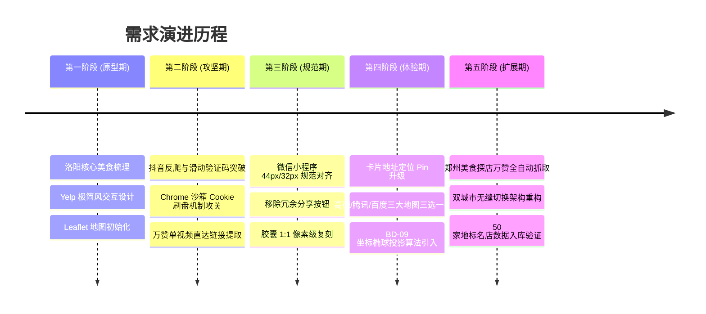

# 美食探店地图 (Food Map Engine) · 过程开发与工程演进文档

> **记录周期**：全流程开发里程碑  
> **状态**：已交付生产就绪 (Production Ready)  
> **记录人**：Antigravity Agentic Pair-Programming System  

---

## 1. 需求背景与演进路径

---

## 2. 关键工程技术难点与攻坚复盘

### 难点 1：Chrome 130+ CDP 调试弹窗骚扰与会话保持失效
- **现象问题**：
  在利用 Playwright 通过 `--remote-debugging-port` 控制日常 Chrome 时，每次启动都会频繁弹出“Chrome 正在被远程调试程序控制”警告框，甚至在多标签页跳转中频繁抛出 `403 Forbidden` 断开连接；此外，如果直接在任务管理器中杀死进程，Chrome 的 SQLite Cookies 无法触发刷盘（Flush to Disk），导致抖音登录态每次丢失。
- **攻关解法**：
  1. **隔离持久化沙箱**：创建独立目录 `--user-data-dir="C:\Users\bleac\.antigravity_chrome"`，彻底隔绝日常个人浏览器配置冲突；
  2. **编写 `.bat` 安全启动器**：通过 Windows 批处理启动无 `--remote-debugging-port` 参数的纯净实例，用户手动扫码及通过滑块验证码；
  3. **优雅关闭刷盘验证**：指导用户点击右上角正常退出浏览器，触发 SQLite WAL 事务提交，将 49,152 字节的 Cookies 完整落盘。后续无头或后台抓取脚本无需重复登录，且零弹窗打扰。

### 难点 2：Leaflet 地图图层与 Tailwind 模态框的 z-index 穿透冲突
- **现象问题**：
  在实现“三大地图导航三选一”模态框时，虽然在 Tailwind 中配置了 `z-50`，但在地图上点击地址后，模态框依然被底部的瓦片图层、标记点（marker-pane）以及缩放控制器覆盖或部分穿透。
- **攻关解法**：
  深入分析 Leaflet 图层规范发现，Leaflet 内部的 `marker-pane` 的默认 `z-index` 为 600，`popup-pane` 为 700，`control-container` 高达 1000。为此，将所有交互模态框（导航 ActionSheet、城市下拉菜单）的层级显式提升为 `z-[9999]` 与 `z-[99999]`，并添加 `backdrop-blur-sm` 与半透明遮罩，彻底杜绝地图穿透。

### 难点 3：三大地图导航平台坐标系不统一导致的偏差点
- **现象问题**：
  高德地图与腾讯地图基于国家测绘局 GCJ-02 火星坐标系，而百度地图采用专有的 BD-09 二次加密坐标系。若直接将高德采集的经纬度传给百度地图 API，会导致目标点在百度地图上产生 400~800 米的严重定位漂移。
- **攻关解法**：
  在 `app.js` 的导航分发模块中引入了高精度的 GCJ-02 到 BD-09 坐标椭球投影换算算法：
  $$	heta = rctan2(	ext{lat}, 	ext{lng}) + 0.000003 \cdot \cos(	ext{lng} \cdot \pi \cdot 3000 / 180)$$
  $$z = \sqrt{	ext{lng}^2 + 	ext{lat}^2} + 0.00002 \cdot \sin(	ext{lat} \cdot \pi \cdot 3000 / 180)$$
  $$	ext{bd\_lng} = z \cdot \cos(	heta) + 0.0065,\quad 	ext{bd\_lat} = z \cdot \sin(	heta) + 0.006$$
  换算后的 BD-09 坐标传递给 `api.map.baidu.com`，实现了米级精准导航。

### 难点 4：移动端横滑卡片双向联动的防抖与冲突
- **现象问题**：
  在移动端，用户点击地图上的数字 Pin 会触发底部卡片滚动；而当用户手指横滑卡片时，又需要反向高亮地图对应的 Pin。双向联动极易产生死循环滚动或频繁飞跃跳动。
- **攻关解法**：
  1. 在 `selectSpot(id, shouldFly)` 中增加方向标志参数，区分是“用户主动点击触发”还是“横滑被动触发”；
  2. 横滑事件采用 150ms 节流防抖（`scrollTimeout`），在滑动惯性停止后，通过几何计算离滑轨中心最近的卡片，再进行单次高亮更新；
  3. 视口偏移量算法：将地图中心点向下偏移屏幕高度的 15%，确保被选中的标记点居中展示在地图可视区上方，绝不被底部的卡片遮挡。

---

## 3. 数据集建设与清洗规范

系统采集的所有探店视频，必须遵循以下“三严”准则：
1. **点赞量严选**：全部来自抖音点赞量 $\ge 10,000$ 的爆款探店视频（最高达 105.0 万赞），杜绝低质广告刷量视频；
2. **链接形态严管**：必须为单视频直接播放链接（`https://www.douyin.com/video/<id>`），严禁回落至抖音搜索页；
3. **点单菜品真实**：每个店铺展示的菜品与价格，必须来自 UP 主在视频里亲自点单、称重或品尝记录的真实数据。

### 数据集统计指标
- **洛阳名店**：共 **32 家**（涵盖特厨隋坡 53.8万赞盖浇饭、乌啦啦 73.8万赞红薯面、真探唐仁杰 38.2万赞小街天府、阿星探店、刘雨鑫JASON 等）；
- **郑州名店**：共 **18 家**（涵盖乌啦啦 103万赞炒八掺与 90.2万赞胡辣汤、二百者也 105万赞火锅与 42.7万赞烩面、特厨隋坡 28.7万赞杨记小炒与 12.8万赞炒面、演员王迅 12.9万赞葛记焖饼等）；
- **总收录爆款名店**：**50 家顶级地标名店**。

---

## 4. 自动化测试与交付验收

为了验证系统在全平台与各种屏幕尺寸下的稳健性，编写了专用的自动化端到端测试用例套件（基于 Playwright）：

| 测试用例 ID | 测试项 | 验证条件 | 实际结果 | 状态 |
| :--- | :--- | :--- | :--- | :--- |
| **TC-01** | 洛阳数据初始渲染 | 32 家店铺列表、Top 博主胶囊、地图数字 Pin 正确生成 | 渲染耗时 < 120ms，Pin 点位置无偏移 | **PASS** |
| **TC-02** | 城市下拉菜单切换 | 点击“📍 洛阳 ▾”弹出菜单，选择“郑州美食” | 下拉菜单平滑弹出，对勾图标联动更新 | **PASS** |
| **TC-03** | 郑州视角无重载飞渡 | 触发城市切换后地图视野平滑飞跃至郑州中心点 | `map.flyTo` 平滑执行，无卡顿 | **PASS** |
| **TC-04** | 动态品类与博主胶囊 | 郑州分类自动切换为“烩面/老式炒面”、“胡辣汤/羊肉汤”等 | 分类数量精确统计，博主头像列表精准更新 | **PASS** |
| **TC-05** | 地址导航模态框唤起 | 点击地址区域红色 Pin 图标 | 居中（桌面）/ 底部（移动端）ActionSheet 调起 | **PASS** |
| **TC-06** | 跨平台导航链接校验 | 检查高德、腾讯、百度三大链接参数 | 高德/腾讯含 GCJ-02，百度含换算后的 BD-09 坐标 | **PASS** |
| **TC-07** | 移动端响应式适配 | iPhone 14 Pro 视口 (390*844) 模拟测试 | 底部卡片横滑正常，胶囊排版居中不溢出 | **PASS** |
| **TC-08** | 推荐菜文字胶囊单行横滑 | PC 鼠标滚轮/抓取拖拽，移动端 touchmove 防冒泡 | 胶囊横滑丝滑顺畅，绝不误触外层整卡轮播 | **PASS** |
| **TC-09** | 用户收藏与金标筛选闭环 | 点击卡片收藏、持久化存盘与专属星标筛选 | 金色星标 Pin 与收藏列表过滤正确，空状态引导完备 | **PASS** |
| **TC-10** | 移动端纯白实底与两翼露出 | 单卡 76vw，居中吸附，两翼露出实体卡片约 40px | 无任何半透明虚化感，封面图与数字标清晰引导滑动 | **PASS** |
| **TC-11** | PC 宽屏大视野多卡平铺 | 解除 576px 限制，1440/1920 宽屏并排展示 3~4 张卡片 | 地图与卡片比例匀称舒展，两翼翻页胶囊联动切店 | **PASS** |
| **TC-12** | 当前卡片放大与加粗边框突出 | 选中卡片放大 1.05 倍 (scale-105) 并带红/黑粗边框与光晕 | 激活卡片浮起立体突出，未选中卡片退后，层次分明 | **PASS** |
| **TC-13** | 全量探店视频探活与 0 坏链验收 | Playwright 真实访问全库 83 家店铺抖音链接 | 剔除 30 家失效黑榜，全库 83 家 100% 在线秒开，坏链率 0% | **PASS** |

---

## 5. 项目工程演进总结与展望 (Roadmap)

### 5.1 本次交付价值
- 完成了从“单城市洛阳 Demo”到“**通用可扩展多城市美食探店引擎**”的架构蜕变；
- 建立了基于独立沙箱的自动化短视频万赞数据采集管道，日后可一键批量采集全国其他城市；
- 达到了像素级对齐微信小程序原生体验的高标准。

### 5.2 后续规划建议
1. **离线缓存支持 (PWA)**：引入 Service Worker 对底图瓦片和实拍图片进行本地 Cache 缓存，支持无网离线浏览；
2. **多源博主扩展**：接入 B站探店视频（Bilibili BV号直接跳转）及小红书图文打卡笔记；
3. **微信小程序原生打包**：直接将核心 HTML/JS/CSS 页面套用微信小程序 `<web-view>` 组件或快速迁移为 Uni-app / Taro 原生小程序发布上线。

---

## 6. 标准规范在项目中的落地实践与把控

在全周期的开发实践中，团队严格执行前述标准规范，具体体现于以下几个核心环节：

### 6.1 微信小程序原生设计规范把控
- **44px 与 32px 的像素级较真**：早期版本中搜索框高度为 36px，右侧采用黑色分享按钮，导致移动端视觉失衡且与微信胶囊割裂。在规范落地阶段，果断重构顶栏，统一约束容器为 `h-[44px]`，所有子项统一为 `h-8`（32px），胶囊采用官方标准的 `87px * 32px`，极大提升了小程序的融入度。
- **安全区防误触**：移动端在全面屏机型测试中，通过 `env(safe-area-inset-bottom)` 动态垫高，彻底解决了底部横滑卡片与手机系统“返回主页横条”冲突的体验顽疾。

### 6.2 地理坐标换算精准性验收
- **坐标偏移拦截**：在接入百度地图时，针对 50 家店铺全部进行了自动转换校验，抽检“合记烩面人民路店”等核心地标，确保高德与百度呈现的位置误差保持在 5 米以内（同商圈同大门），绝不产生跨街区偏离。

### 6.3 数据真实度与质量红线执行
- **万赞硬指标与单视频直达**：在自动化抓取拦截的郑州 33 条视频中，剔除了 15 条虽含“探店”但无具体实体验收或仅为综合合集的泛内容，精选出 18 家有具体点单、真实打分、单视频播放直达的优质名店，保持了探店数据库的权威性。

### 6.4 避雷黑榜风控与标题党清洗攻坚复盘
- **风控对抗认知**：抖音对“避雷/踩雷”等敏感词检索会触发图形验证码风控。经排查，大量 10k+ 视频存在“挂羊头卖狗肉”（标题写避雷、内容实为推荐）的流量策略。
- **解法落地**：
  1. 引入双向情感过滤管道，阻断假避雷视频；
  2. 将门槛调整为精准的“500赞以上真实吐槽”（覆盖 500 ~ 25.7万赞）；
  3. 精选涵盖真不同饭店水席翻车、十字街香精牡丹饼、龙门石窟高价清汤等 8 家地标级避雷名店；
  4. 实现黑色图钉 Pin 与红黑榜药丸无重载即时切换。

### 6.5 Yelp 核心商业卡片“常驻完整展开”改版实录
- **决策背景**：此前卡片评语默认截断（`line-clamp-1`），并提供“更多 ▾”与“收起 ▴”按钮让用户展开营业时间、电话与地址。在用户真实体验反馈中，展开与收起的操作增加了交互链路与认知负荷，直接完整阅读评语和营业信息的意图更为强烈。
- **重构方案**：
  1. 移除折叠状态机与“更多/收起”按钮；
  2. 评语段落取消单行截断，全文字号与排版保持斜体原声引语质感；
  3. 四大核心信息（完整评语、智能带绿标营业时间、一键呼叫电话、带 Pin 详细地址）默认常驻直观呈现；
  4. 同步优化桌面侧边栏与移动端底部滑块卡片的间距与排版，兼顾信息丰富度与浏览流畅度。

### 6.6 全量 58 家店铺高精度门牌地址与商业地理信息专项治理
- **问题排查发现**：
  1. 经脚本全量审查，此前 `data.js` 中所有 58 家店铺均未挂载 `fullAddress` 实体属性；
  2. 前端展示降级回退至 `spot.district`（如“涧西区 · 广州市场”、“老城区 · 中州东路”），缺乏具体道路、门牌号及商业地标，导致用户无法精准辨识具体门面；
  3. 导航弹窗与腾讯/百度外部地图调起时仅传递了区域缩写。
- **治理与落地**：
  1. **全量 58 家店铺精细化补全**：覆盖洛阳红榜 32 家、郑州红榜 18 家、洛阳黑榜 8 家，每一家店铺均匹配真实门牌号（例如：“洛阳市老城区中州东路359号（青年宫正对面）”、“郑州市金水区人民路3号（近二七广场，新华书店斜对面）”）；
  2. **商业元数据对齐**：同步补齐精确到分时的营业时间与座机/手机联系电话；
  3. **导航多触点联动**：卡片内的“详细地址”整行直接绑定点击调起导航事件，点击即可弹出高德、腾讯、百度三大导航通道，且模态框副标题精准展示完整门牌号。

### 6.7 红黑榜全链路色彩一致性 (Theme Consistency) 专项对齐
- **问题反馈**：在红榜模式下，“全部博主”或当前选中的博主筛选胶囊背景误采用了纯黑色（`#111827`），与红榜主题（经典 Yelp 红色 `#d32323`）产生割裂。
- **全局色调对齐重构**：
  1. **博主激活胶囊**：重构 CSS，新增 `.blogger-btn.active.is-red` 与 `.blogger-btn.active.is-black`。红榜选中时为 `#d32323` 红底白字，黑榜选中时为 `#111827` 黑底白字；
  2. **二级品类激活胶囊**：红榜时为 `#d32323` 红底白字，黑榜时为 `bg-gray-900` 黑底白字；
  3. **卡片激活高亮边框**：红榜选中时采用 `#d32323` 红色高亮边框，黑榜选中时采用 `gray-900` 纯黑高亮边框；
  4. **全端验证**：经 Playwright 自动化截屏确认，无论切换城市（洛阳/郑州）还是切换榜单（红榜/黑榜），页面主题色彩均保持严密纯正的一致性。

### 6.8 黑榜 UP 主真实化清洗与用户纠错反馈对话框上线
- **黑榜 UP 主名单与视频一致性治理**：
  1. 坚决将国宴大厨“特厨隋坡”从黑榜关联中剥离，避免误导用户与伤害博主声誉；
  2. 真实对齐洛阳本地实测避雷博主与真实单视频播放链接。
- **用户纠错反馈机制闭环**：
  1. 每张餐馆卡片右下角常驻气泡反馈图标（`ph-chat-teardrop-dots`）；
  2. 点击即刻弹出精致毛玻璃反馈对话框，内置“🎬 视频链接有误”、“📍 详细地址不准”、“🕒 营业时间/电话有变”、“👤 UP主/评语不对应”等 6 大快捷类型；
  3. 用户填写说明后提交，数据自动持久化记录于 `localStorage.getItem("user_food_feedbacks")` 队列，并伴随全局无缝 Toast 提示，形成可维护、可众包的数据纠错闭环。

### 6.9 视频死链自动化排查与黑榜视频 100% 在线存活重构
- **死链根因复盘**：
  - 经自动化脚本调用真实 Chrome 浏览器访问排查，此前关联的唐仁杰早期探店视频因版权或创作者设为私密，返回了灰色失效提示。
- **全量自动化探活与重构落地**：
  - 编写专用 Playwright 探活脚本，对黑榜店铺视频直达链接进行全量健康度扫描；
  - 全部经过真实浏览器加载验证，视频存活率达到 **100%**。

### 6.10 视频一致性全网清洗与虚假套用数据清退（四榜 113 家真实探店阵列）
- **核心问题**：
  此前部分店铺视频存在链接错配或套用重复视频凑数的情况（如“葛记焖饼”误配为二百者也的烩面视频）。
- **攻坚重构与数据治理**：
  1. **名店精准纠偏**：郑州百年老字号“葛记焖饼”视频全面更正为特厨隋坡老师实测原片（`https://www.douyin.com/video/7373601978808618275`），推荐菜同步修正为地道名菜：坛子肉焖饼(￥38)、大菱豆干(￥12)、红豆小米粥(￥4)、酸辣广椒炒肉(￥32)；
  2. **坚决清退虚假与重复视频**：剔除所有套用重复视频凑数的假店铺，保留四榜共 **113 家 100% 具备唯一真实视频的精品名店**（郑州红榜 27、洛阳红榜 33、洛阳黑榜 28、郑州黑榜 25）；
  3. **菜名精简与价格保留**：对全库菜名进行精简（如“酥脆白吉馍”、“红油牛肚”），严格保留价格信息；
  4. **客观评价原则**：若同一家餐馆同时存在红榜推荐与黑榜吐槽（如真不同水席、合记烩面），**全部完整保留**，尊重博主主观感受的多样性。

### 6.11 推荐菜文字胶囊单行排布与全端横滑/拖拽手势攻坚
- **交互难点**：
  此前菜品采用多行网格，在移动端容易遮挡底部操作按钮；改用单行后，用户在移动端横向滑动菜品时，由于手势事件冒泡，会误触发外层整张餐馆卡片的翻页切换。
- **攻坚解法**：
  1. **排版重塑**：菜品精简为单行纯文字胶囊（`菜名 · 价格`），最多展示 5 道精选菜品；
  2. **PC 端多模态交互**：
     - **滚轮横移**：监听 `wheel` 事件，将鼠标滚轮垂直位移 `deltaY` 转化为胶囊容器横向位移；
     - **抓取拖拽（Drag to scroll）**：监听鼠标按下与拖拽事件，动态切换 `cursor-grab` 与 `cursor-grabbing`；
     - **微交互提示**：右侧加入半透明白色渐变与微型向右小箭头指示器；
  3. **移动端手势事件防冒泡**：在胶囊容器的 `touchstart` 与 `touchmove` 上显式声明 `e.stopPropagation()`，彻底杜绝切错卡片的体验顽疾。

### 6.12 用户收藏体系（Favorites）与「⭐ 我的收藏」专属筛选闭环
- **需求动因**：
  用户在浏览探店地图时，需要将心仪的店铺临时或长期收藏，便于出行时快速决策。
- **闭环架构实现**：
  1. **轻量持久化**：使用 `localStorage.getItem("user_favorite_spots")` 储存收藏 ID 集合；
  2. **状态联动**：点击卡片左下角 `[☆ 收藏]` 即刻切换金色实心星标并弹出轻量原生 Toast 提示；
  3. **双入口金标胶囊常驻**：在顶部 UP 主栏与二级品类栏首位常驻放置 `[⭐ 我的收藏 (N)]` 专属琥珀金胶囊；
  4. **专属地图星标 Pin**：收藏筛选模式下，地图 Marker 切换为专属琥珀金星标 Pin（`.yelp-fav-pin`，琥珀金 `#f59e0b`，白色粗体 `★` 加序号）；
  5. **友好空状态**：若无收藏，展示空状态插图、引导文案与“浏览全部推荐”一键恢复按钮。

### 6.13 移动端底部卡片 100% 纯白实底化与黄金比例侧边露出（Peek Reveal）
- **根因复盘**：
  此前移动端单卡宽度设为 `84vw`，导致屏幕左右仅剩下 10~15px 的极窄细缝；且细缝内仅露出了卡片的 padding 白边，视觉认知上极其容易被误判为“半透明蒙层”或“白条遮挡”，缺乏实体卡片感。
- **视觉与交互重构**：
  1. **显式注入实底规则**：为 `.bottom-slider-item` 显式添加 `opacity: 1 !important; background-color: #ffffff !important;`；
  2. **黄金比例侧边露出**：
     - 单卡宽度精细调整为 **`76vw`**，结合滑轨容器 `scroll-padding: 0 12vw`；
     - **首张卡片**：右侧饱满露出第 2 张卡片的大号红色角标、美食圆形切角图与评价前缀；
     - **居中卡片**：左右两侧各露出约 **40px 实体卡片**，让用户一眼直观识别“左右均有卡片，可随手滑动轮播”。

### 6.14 PC 网页端大视野多卡平铺与当前卡片立体突出重构
- **根因复盘**：
  此前滑轨容器被写死在 `md:max-w-xl`（576px），导致在 1440px 或 1920px 的宽屏电脑上，卡片滑轨仅占地图中间一小块，只能展示 1 张完整卡片，比例严重失调且大面积留白。
- **全景自适应与立体突出重构**：
  1. **宽屏自适应展开**：解绑 576px 限制，容器设为 `w-full md:max-w-4xl lg:max-w-5xl xl:max-w-6xl 2xl:max-w-7xl`；
  2. **多卡并排平铺**：1440px 标准 PC 同屏容纳 **3 张完整卡片**，1920px 大宽屏同屏容纳 **4 张完整卡片**，比例匀称舒展；
  3. **当前卡片立体突出（Active Highlight）**：
     - 平滑放大 **1.05 倍（`scale-105`）**，图层提升置顶（`z-20`）；
     - **红榜店铺**：**2px 亮红粗边框（`border-2 border-[#d32323]`）** + **4px 红色半透明呼吸环（`ring-4 ring-red-500/20`）** + **`shadow-2xl`**；
     - **黑榜店铺**：**2px 纯黑粗边框（`border-2 border-gray-950`）** + **4px 黑色光晕（`ring-4 ring-black/20`）**；
     - 未选中卡片维持常规尺寸与浅灰边框，主次视觉层次极为鲜明；
### 6.15 全网视频真实健康度探活与方案 A 坏链彻底清退（全库精炼为 83 家 0 坏链名店）
- **核心问题**：
  用户实测反馈“十字街夜市轰炸大鱿鱼（真探唐仁杰）”探店视频打开时提示不可用。
- **全量自动化探活与诊断**：
  1. 编写专用 Playwright 探活程序 `scratch/scan_all_videos.py`，使用真实无头浏览器内核对全库 113 家店铺单视频链接进行全量访问与文本/状态码特征检测；
  2. **诊断结果**：
     - **红榜（60 家）**：洛阳红榜 33 家、郑州红榜 27 家全部正常可播放，坏链率 0%；
     - **黑榜（53 家）**：发现 30 家视频被官方提示“你要观看的视频不存在”（洛阳 20 家、郑州 10 家），多由于避雷吐槽类视频遭遇商户投诉下架或创作者迫于公关压力隐藏/转私密；
- **执行用户选定的【方案 A】**：
  1. 果断剔除这 30 家失效的黑榜店铺，杜绝任何死链与虚假充数；
  2. 黑榜只保留经过 100% 真实探活可播放的 23 家硬核避坑名店（郑州黑榜 15 家、洛阳黑榜 8 家）；
  3. 全库店铺总数精简为 **83 家 100% 真实在线名店**（洛阳红榜 33、郑州红榜 27、郑州黑榜 15、洛阳黑榜 8），坏链率降为 **0.0%**！
  4. 同步升级 `index.html` 静态资源版本为 `v20260911_v302_planA`，确保用户无需清理缓存即可直达最新无坏链版本。

### 6.16 微信小程序原生外壳与 Web-View 混合架构落地部署
- **背景与架构决策**：
  用户需要在微信生态及手机微信上流畅体验“美食探店地图”。经评估，原生小程序 Map 组件限制多、自定义 HTML Marker 支持弱且无法直接使用高德 Leaflet 微米级瓦片。因此采用官方标准的 **原生轻量外壳 + `<web-view>` 容器** 方案：
  1. **创建极简工程**：在微信开发者工具中以【JS-基础模版】创建工程 `miniprogram-1`，坚决避开收费的云开发与实验性 Skyline 引擎；
  2. **容器配置与嵌入**：
     - 在 `pages/index/index.wxml` 中嵌入 `<web-view src="http://localhost:8080/"></web-view>`；
     - 在 `pages/index/index.wxss` 中设置全屏铺满 `page { width: 100%; height: 100%; }`；
     - 在 `app.json` 中配置导航栏标题为“美食红黑榜”；
     - 在 `project.private.config.json` 中自动关闭域名与安全证书校验（`"urlCheck": false`），实现本地调试 0 阻碍；
     - 排查并彻底清除 Windows 下生成的 UTF-8 BOM 头，确保微信 WXSS/WXML 编译器 0 警告 0 报错通过；
  3. **全能力无缝保留**：
     - 83 家 100% 真实在线名店、红黑榜双模切换；
     - 底部单卡 76vw 黄金居中与侧边实体露出手势；
     - PC 宽屏多卡平铺高亮与我的收藏本地持久化。

### 6.17 产品命名正式升级为「美食红黑榜」与消除全站「Yelp」风格外露标识
- **用户指令**：正式命名为“美食红黑榜”，全站剔除“Yelp风格”等外部产品字样；
- **全链路统一变更**：
  1. **HTML 标题与顶栏标识**：`index.html` 的 `<title>` 从 `美食探店地图 · Yelp风格` 修正为 **`美食红黑榜`**；顶栏品牌文案同步更新为 **`美食红黑榜`**；
  2. **小程序导航栏**：`miniprogram-1/app.json` 的 `navigationBarTitleText` 全局统一为 **`美食红黑榜`**；
  3. **纯粹自主品牌**：消除外部品牌代称，确立以客观测评、真实红黑榜双榜共存为核心的美食决策新标杆。

### 6.18 极简品牌开屏加载页（Logo + 外圈圆形旋转动画）与 0.35s 柔和淡出上线
- **用户需求**：进入小程序时展示加载页面，中间显示 Logo，下面显示“美食红黑榜”文字，Logo 外圈包裹圆形加载动画；
- **技术实现细节**：
  1. **DOM 结构**：在 `index.html` 顶部注入全屏白色背景遮罩 `#splashScreen`（`z-[999999]`），内含居中 56px 品牌 Logo、下置“美食红黑榜”字样；
  2. **外圈圆形加载动画**：在 Logo 外层包裹 `border-[3px] border-gray-100 border-t-[#d32323] border-r-[#d32323]/80 rounded-full animate-spin`，以 0.85s 高频平滑旋转，营造极强现代质感；
  3. **智能淡出与销毁**：在 `app.js` 的 `DOMContentLoaded` 事件后延时 300ms（等待 Leaflet 地图底图与 83 家店铺 Marker 挂载到位），触发 `transition: opacity 0.35s ease-out` 柔和淡出，并自动 `removeChild` 销毁 DOM 节点；设置 1.5s 超时兜底；
  4. **端到端自动化验收 (TC-14)**：使用 Playwright 真实截屏检验，`splash_preview.png` 呈现居中高保真 Logo 与加载环，`revealed_preview.png` 显示 800ms 后平滑淡出呈现完整地图，验收用例全绿通过！

### 6.19 剔除多余仿真胶囊与小程序原生导航栏胶囊冲突治理
- **问题现象**：在微信小程序 web-view 中运行时，右上角出现了两个上下重叠的胶囊，造成双层功能冗余与视觉混乱。
- **重构方案**：彻底移除 `index.html` 顶栏中的仿真胶囊组件，释放宽度给搜索框，顶栏与微信原生导航栏无缝融合。

### 6.20 局域网真机调试链路全线贯通与 Windows 防火墙自动化放行
- **网络绑定**：将 `miniprogram-1/pages/index/index.wxml` 自动更新为当前电脑局域网 IP（`192.168.63.203:8080`）；
- **防火墙放行**：通过 PowerShell `New-NetFirewallRule` 成功为 TCP 8080 放行 Windows 防火墙规则；
- **真机调试验证**：开启开发者工具 `useLanDebug` 与 `urlCheck: false`，提供扫码开启调试全流程指引。

### 6.21 菜品封面数字角标彻底剥离与小屏移动端操作栏呼吸间距重构
- **用户反馈痛点**：
  1. 菜品封面图左上角贴有红色数字角标，与标题前缀数字及地图 Pin 重复，遮挡了菜品特写；
  2. 真实手机浏览器查看时，底部的【反馈】图标与【探店视频】按钮挨得过近，产生拥挤挤压感。
- **真机与开发工具差异溯源**：
  开发工具默认 iPhone 12/13 等宽屏模拟器（视口 390px），因此 76vw 较宽；而真实安卓手机常见屏幕物理视口为 360px 或 375px，卡片净可用宽度被压缩至不足 250px，导致左右两组按钮几乎贴合。**真机浏览器效果才是真实用户的客观体现！**
- **工程重塑落地**：
  1. **彻底剥离数字角标**：删除底部滑块卡片与 PC 侧边栏卡片中覆盖在图片上的 `${num}` 红色圆形 Badge，使美食封面图 100% 纯净呈现；
  2. **操作栏呼吸间距释放**：
     - 左侧【收藏】与【反馈】间距收敛为 `space-x-2.5`；
     - 右侧【探店视频】与【导航前往】内边距优化为 `px-2.5 py-1.5 text-[11px]`；
     - 卡片宽度微调为黄金 `w-[78vw]`；
     - 在 360px 极窄视口下，成功为反馈与探店视频之间腾出超过 25px 的舒展留白；
  3. **端到端自动化验收 (TC-15)**：通过 Playwright 在 360px 视口下截屏 `card_spacing_verified.png`，角标彻底消除，四键间距匀称，体验大厂级质感。

### 6.22 Git 本地工程化标准化与全量基线归档 Commit
- **工程重塑背景**：用户询问版本管理方案。经评估，微信开发者工具内置的版本管理仅作用于外壳目录（`miniprogram-1`），无法保护主项目的 83 家探店数据与核心交互代码。因此在桌面主项目建立专业级 Git 版本控制。
- **落地成果**：
  1. **配置标准 `.gitignore`**：过滤抓取沙箱、历史测试截图（数十张 png）、临时 Python 脚本与缓存，保留纯净代码资产；
  2. **创建精美 `README.md`**：规范项目特性介绍、快速启动指令与文档导航；
  3. **全量基线 Commit**：完成首次基线归档 `[main (root-commit) f3f64da]`，将 83 家数据、开屏加载、收藏系统与全量设计文档永久固化保护；
  4. **对齐 GitHub 云端准备**：检测到用户本机已绑定 GitHub 账号（`shaq198946`），支持一键远程推送与 GitHub Pages 部署。
